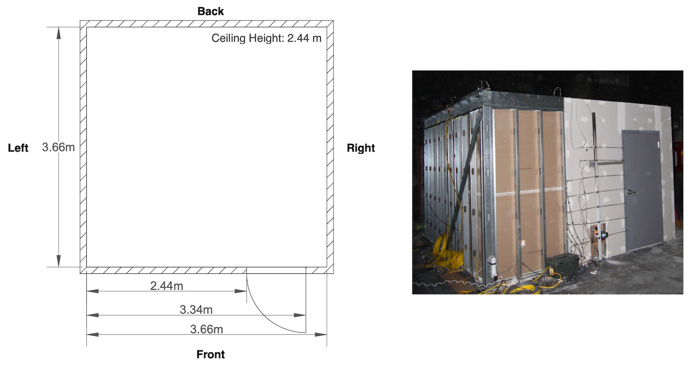
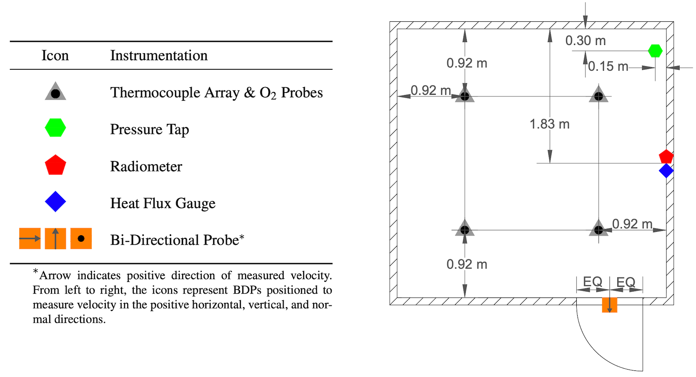

# Experimental Information

## Structure

All experiments were conducted inside a compartment with a 3.7 m by 3.7 m footprint and 2.4 m ceiling height. A single ventilation opening was present at the front of the compartment in the form of a 0.9 m by 2.0 m doorway. The door was either open or closed for the entire duration of each experiment. A dimensioned floor plan view and image of the compartment are presented below.

## Instrumentation

Various types of instrumentation were installed throughout the compartment to measure gas temperature, oxygen concentration, gas velocity, total and radiative heat flux, and pressure. A dimensioned schematic of the sensor group locations is presented below.

With respect to the labeling of sensor groups, the compartment was divided into the quadrants shown in the floor plan view below.

Additionally, during experiments where the fuel was against a wall (i.e., at the corner, back, or side location), heat flux gauges and bi-directional probes (BDPs) were positioned to measure the total heat flux to the adjacent wall along with the gas velocity and temperature within the fire plume. 